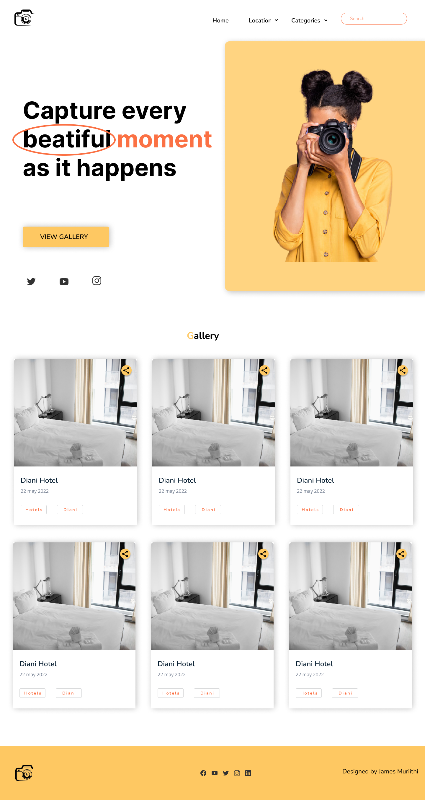
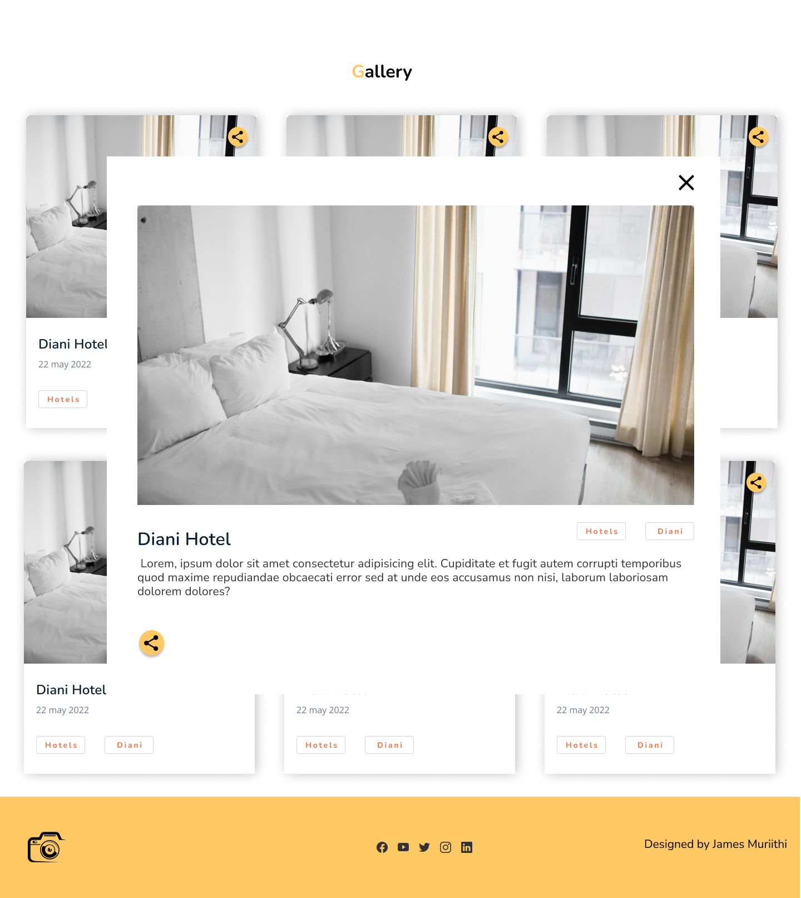
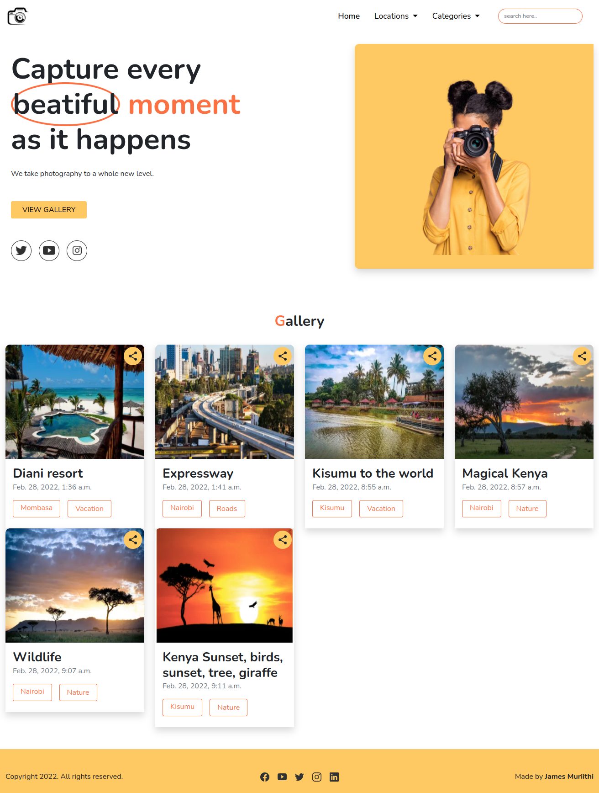
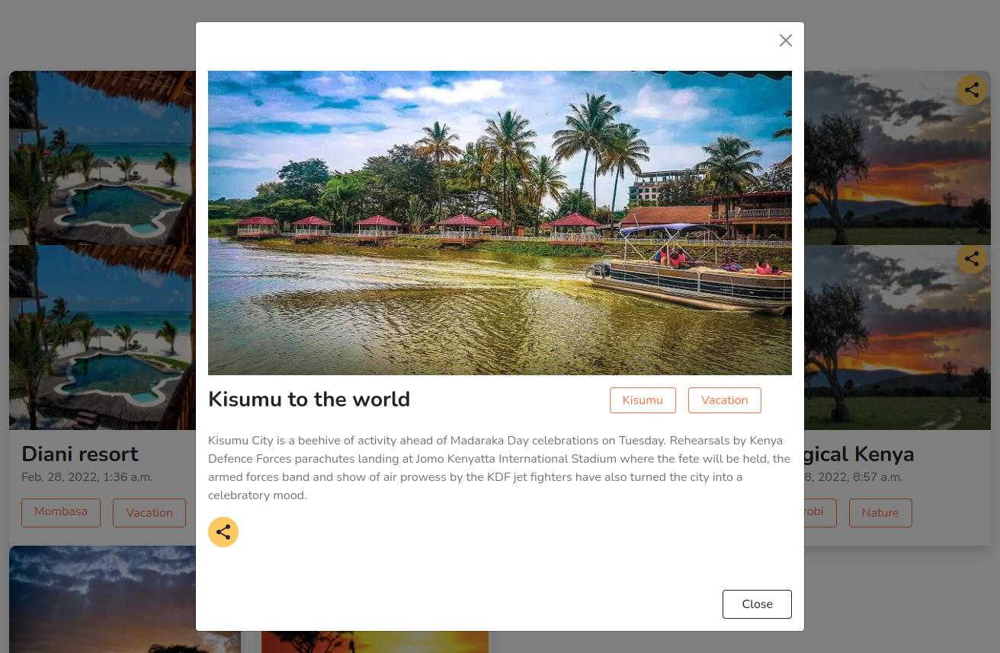
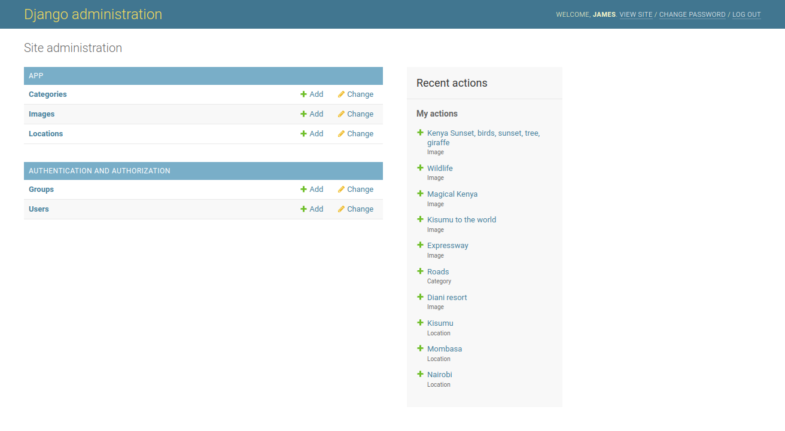

# Gallery
created by James Muriithi on 28/02/2022

## Description
This is a gallery app to showcase all the beatiful images of different locations and categories. It is built with Django and uploads images to cloudinary

## Technologies Used
The following technologies have been used on this project:

* HTML
* CSS
* JS
* Bootstrap
* Django
* Python
* Cloudinary (for image upload)

# Setup / Installation
* clone the repo:

```shell
git clone https://github.com/james-muriithi/django-gallery.git
```

```
cd blog
```
* create virtual environment 

```shell
python3.8 -m venv --without-pip venv
```

* To activate the virtual environment
```shell
source venv/bin/activate
```

* install the packages from requirements.txt
```shell
pip install -r requirements.txt 
```

* setup environment variables
```shell
cp .env.example .env
```
* Execute the shell script and start the server
```shell
python3.8 manage.py runserver
```
* open the browser and navigate to http://127.0.0.1:8000/ to see the application in action

## Design
[Link to design](https://www.figma.com/file/uMYxypoOvxMptkg5a7oaDS/Gallery?node-id=0%3A1)



## Screenshot




## Live link
[Here is the link to the live site](https://django-gallery-moringa.herokuapp.com/)


## Contact details
Email: james.muthike@student.moringaschool.com

## MIT licence

<p>Copyright (c) 2022 Moringa School </p>

Permission is hereby granted, free of charge, to any person obtaining
a copy of this software and associated documentation files (the
"Software"), to deal in the Software without restriction, including
without limitation the rights to use, copy, modify, merge, publish,
distribute, sublicense, and/or sell copies of the Software, and to
permit persons to whom the Software is furnished to do so, subject to
the following conditions:

The above copyright notice and this permission notice shall be
included in all copies or substantial portions of the Software.

THE SOFTWARE IS PROVIDED "AS IS", WITHOUT WARRANTY OF ANY KIND,
EXPRESS OR IMPLIED, INCLUDING BUT NOT LIMITED TO THE WARRANTIES OF
MERCHANTABILITY, FITNESS FOR A PARTICULAR PURPOSE AND
NONINFRINGEMENT. IN NO EVENT SHALL THE AUTHORS OR COPYRIGHT HOLDERS BE
LIABLE FOR ANY CLAIM, DAMAGES OR OTHER LIABILITY, WHETHER IN AN ACTION
OF CONTRACT, TORT OR OTHERWISE, ARISING FROM, OUT OF OR IN CONNECTION
WITH THE SOFTWARE OR THE USE OR OTHER DEALINGS IN THE SOFTWARE.